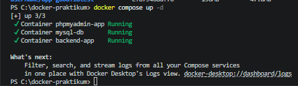
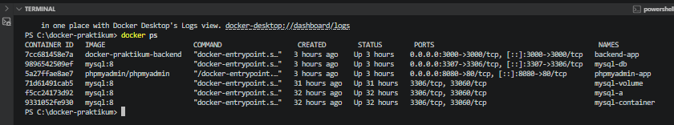
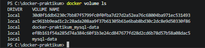
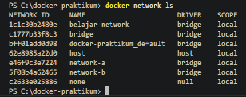
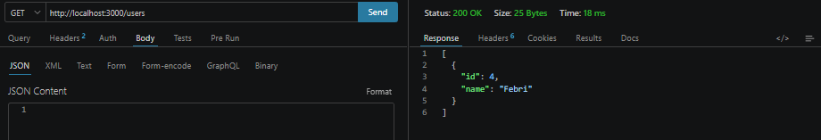
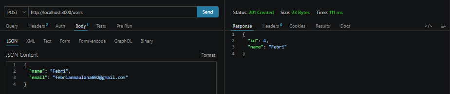
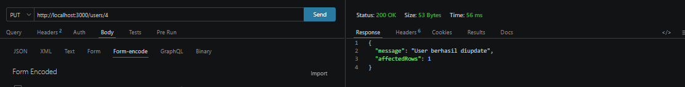
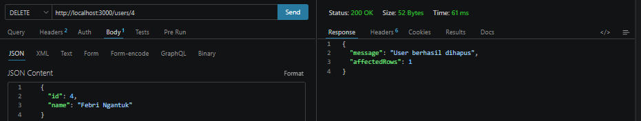
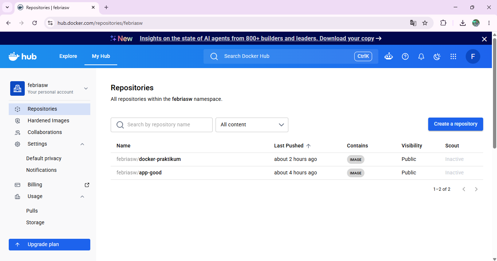
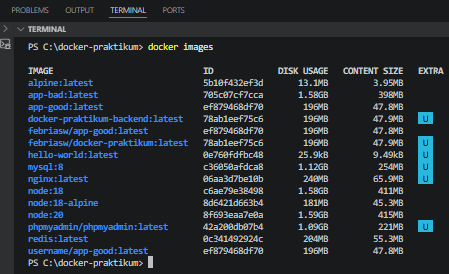

````md
# Laporan Hasil Praktikum: Final Project Aplikasi Berbasis Container

## Identitas Mahasiswa

- **Nama:** Febrian Maulana Labib
- **NIM:** 2415354086
- **Kelas/Rombel:** TRPL B
- **Tanggal Praktikum:** 20 Mei 2026

---

## Teknologi & Tools yang Digunakan

- **Sistem Operasi:** Windows 11
- **Containerization:** Docker & Docker Hub
- **Bahasa Pemrograman / Framework:** Node.js
- **Tools Lain:** VS Code, Git, Postman

---

## Struktur Project

```bash
docker-praktikum/
│
├── backend/
│   ├── app.js
│   ├── Dockerfile
│   ├── Dockerfile.bad
│   ├── package.json
│   ├── .dockerignore
│   └── .env
│
├── docker-compose.yml
└── README.md
```

---

## Langkah-Langkah Praktikum & Dokumentasi

### 1. Pengujian Docker Compose, Volume, Network, dan Container

Pada tahap ini dilakukan pengujian untuk memastikan seluruh service Docker berjalan dengan baik menggunakan Docker Compose. Service yang dijalankan terdiri dari backend Node.js, database MySQL, dan phpMyAdmin.

Perintah yang digunakan:

```bash
docker compose up --build
docker ps
docker volume ls
docker network ls
```

Hasil pengujian:

* Container backend berhasil berjalan pada port 3000.
* Container MySQL berhasil berjalan sebagai database.
* Container phpMyAdmin berhasil berjalan pada port 8080.
* Docker Volume berhasil dibuat untuk menyimpan data MySQL secara persistent.
* Docker Network berhasil menghubungkan backend dengan database menggunakan hostname service `mysql`.

**Dokumentasi/Screenshot:**










---

### 2. Pengujian Endpoint Request dan Response

Pada tahap ini dilakukan pengujian endpoint API menggunakan browser dan tools request API. Endpoint yang diuji meliputi GET, POST, PUT, dan DELETE.

Endpoint yang berhasil diuji:

* `http://localhost:3000`
* `http://localhost:3000/users`
* `http://localhost:8080`

Contoh pengujian endpoint:

```powershell
Invoke-RestMethod -Uri "http://localhost:3000/users" `
-Method POST `
-ContentType "application/json" `
-Body '{"name":"Febri"}'
```

```powershell
Invoke-RestMethod -Uri "http://localhost:3000/users/2" `
-Method PUT `
-ContentType "application/json" `
-Body '{"name":"Febri Update"}'
```

```powershell
Invoke-RestMethod -Uri "http://localhost:3000/users/2" `
-Method DELETE
```

**Dokumentasi/Screenshot:**









---

### 3. Pengujian Upload Image ke Docker Hub

Pada tahap ini dilakukan proses login Docker Hub, tag image, dan upload image ke repository Docker Hub.

```bash
docker login
docker tag docker-praktikum-backend febriasw/docker-praktikum
docker push febriasw/docker-praktikum
```

Image berhasil diupload ke Docker Hub dan dapat digunakan kembali pada perangkat lain.

Link Docker Hub:

```text
https://hub.docker.com/r/febriasw/docker-praktikum
```

**Dokumentasi/Screenshot:**



---

### 4. Pengujian Lainnya yang Diperlukan

Pengujian tambahan dilakukan untuk memastikan image Docker berhasil dibuat dan project berhasil diupload ke GitHub repository public.

```bash
docker images
```

Hasil pengujian menunjukkan image `docker-praktikum-backend` berhasil dibuat dari Docker Compose.

Repository GitHub:

```text
https://github.com/Febri-html/final-project-docker-2415354086
```

**Dokumentasi/Screenshot:**



---

## Kesimpulan

Berdasarkan hasil praktikum, aplikasi backend Node.js berhasil dijalankan menggunakan Docker Compose bersama database MySQL dan phpMyAdmin. Docker Network berhasil menghubungkan antar container, Docker Volume berhasil digunakan untuk menyimpan data database secara persistent, endpoint CRUD berhasil diuji, dan image Docker berhasil diupload ke Docker Hub.

```
```
